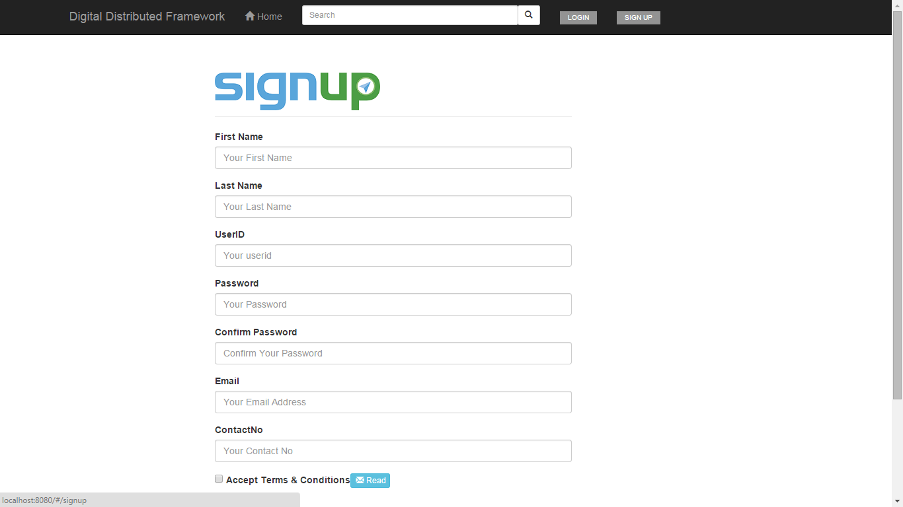
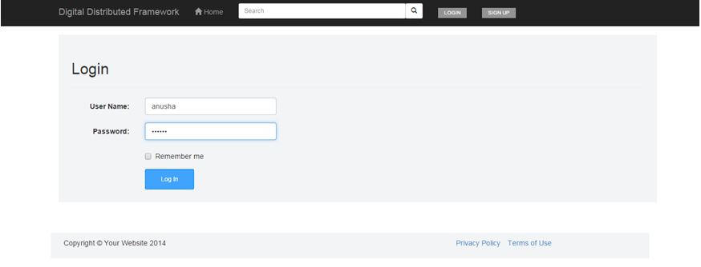
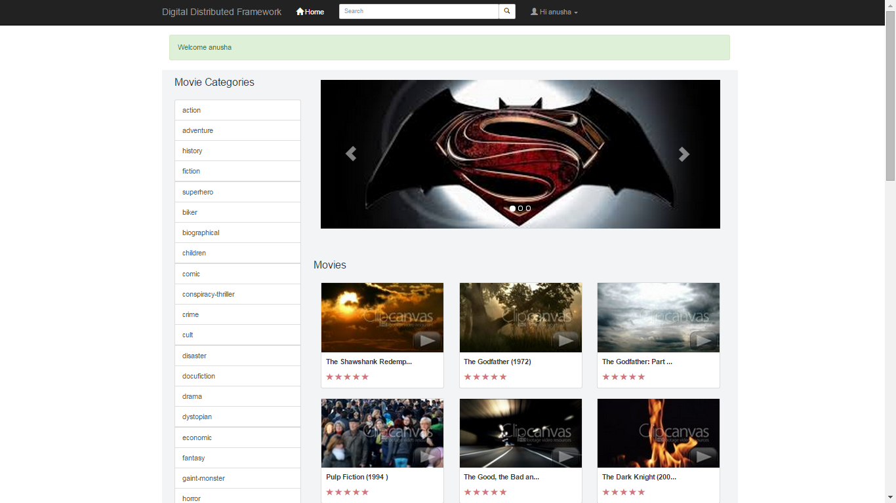
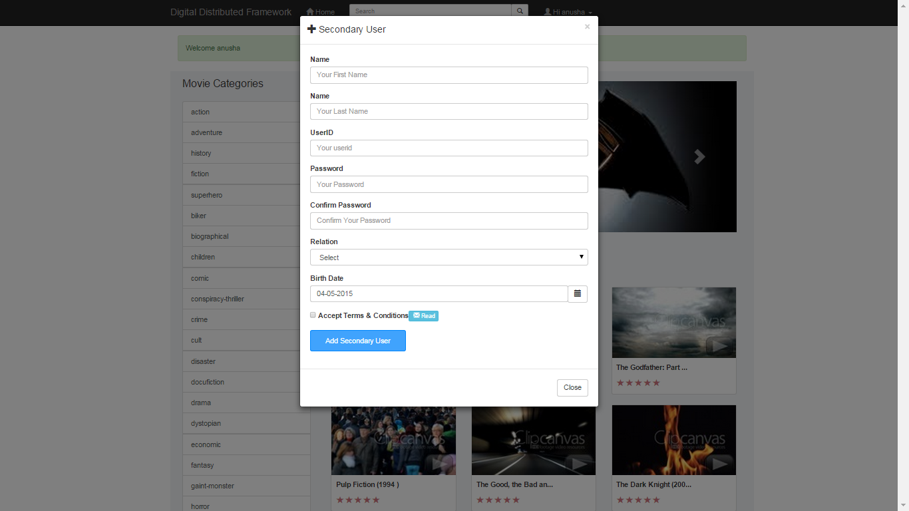
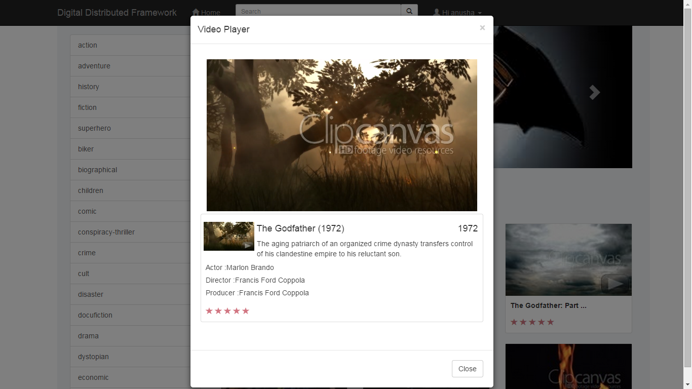
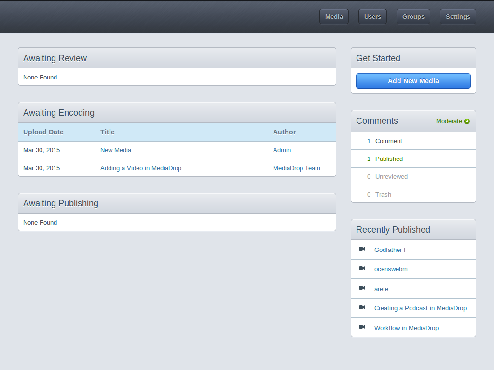
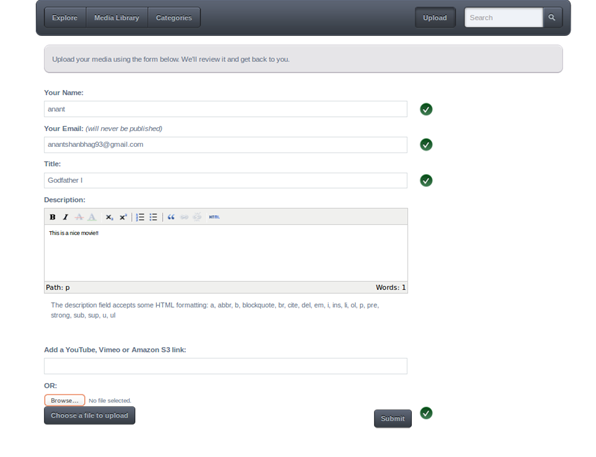
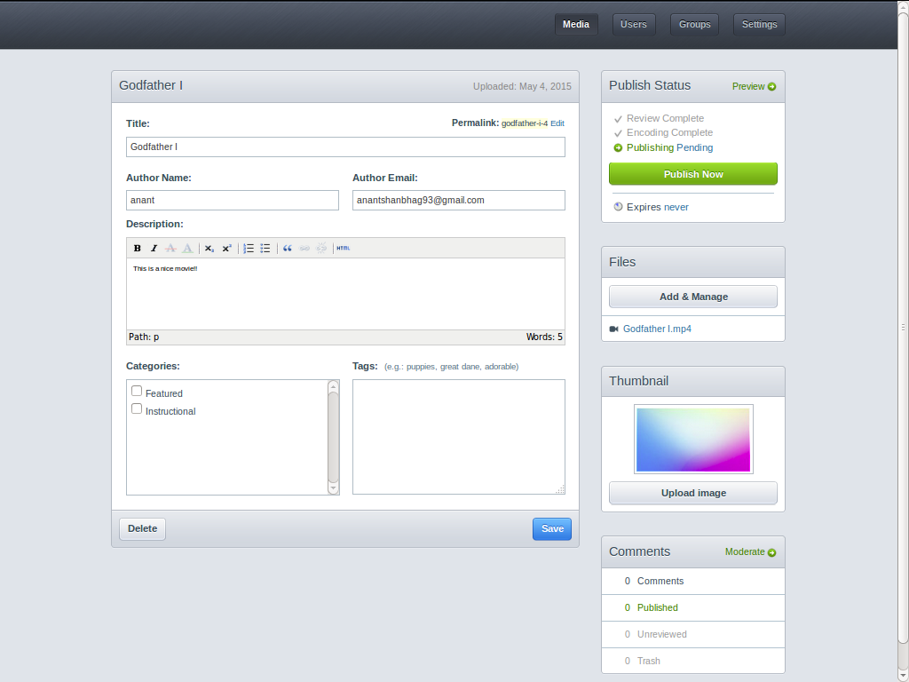
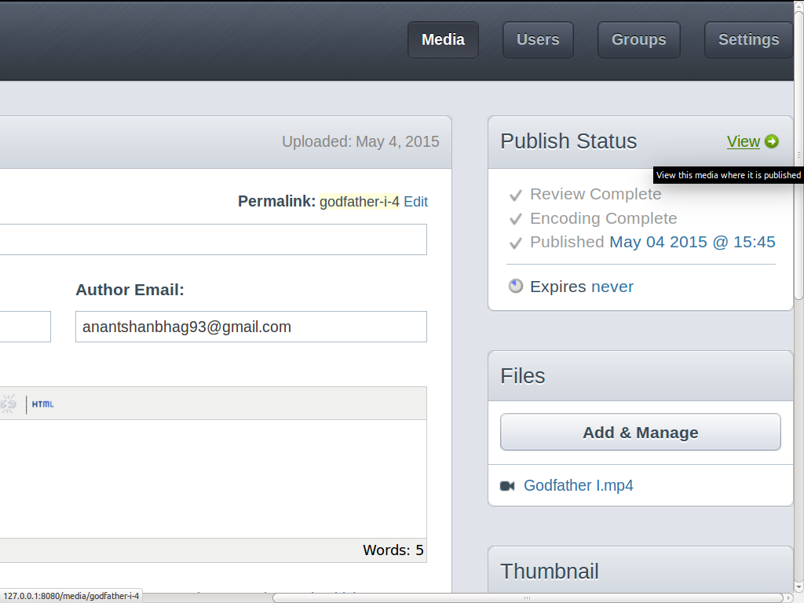
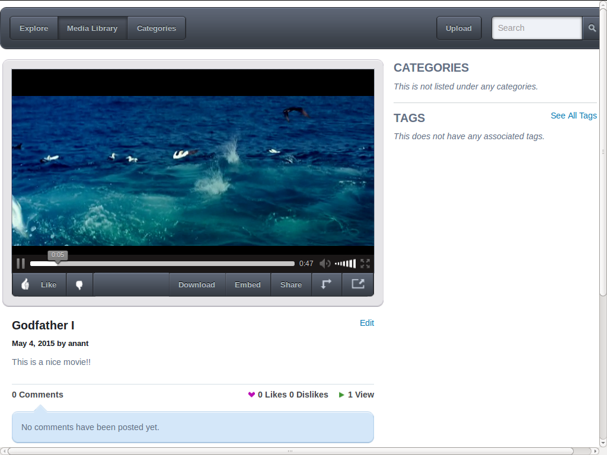

# Digital Distribution Framework

This is a Video On Demand digital marketplace developed in collaboration with Wipro Technologies Ltd.
The project information is proprietary, privileged, and confidential. Wipro policies don’t
allow the code to be used outside Wipro in any form. Only the basic working details of the
project are allowed to be presented. Click [here](College%20Letter%20Mr.%20Anant%20Shanbhag.pdf) to view the certificate.

### Subscriber functionalities
Sign-Up page for Subscribers

Login page for Subscribers

Digital Market Dashboard

Adding secondary user

Video player - Playing trailer only for unsubscribed users

### Content Creator/ Publisher functionalities

Admin dashboard for content creators or publishers

Uploading video

Review and encoding stage complete

Publish the video

Viewing Video

